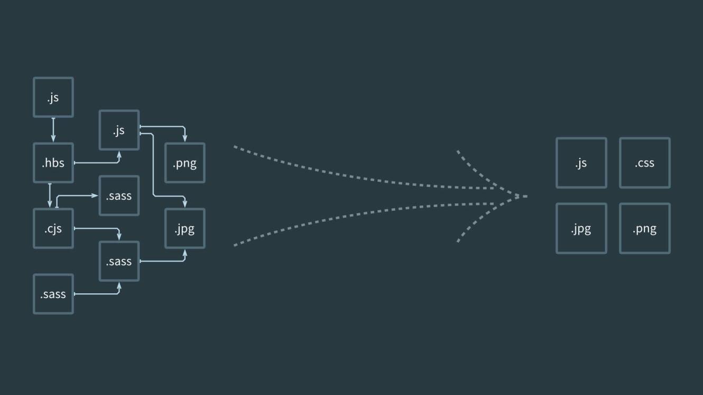

# JavaScript modules

In this article, we will learn JavaScript Modules. Modules are particularly useful for maintaining a clean and organized codebase and can dramatically improve code reuse, comprehension, and maintenance.

You can think of modules as just JavaScript in a separate files. So instead of writing your code in one single file you will split it (but being able to re use each function across different files)


## Why Use JavaScript Modules?

JavaScript modules help you manage and organize your code better. They allow you to split your code into smaller, reusable components that you can import wherever you need them. This approach makes it easier to develop, maintain, and understand complex applications.

When you use JavaScript modules, each module has its own scope. This means that variables, functions, and classes declared in a module are not accessible outside of that module **unless they are explicitly exported**. This helps prevent naming collisions between different parts of your application.

## The Importance of Bundling

Bundling is the process of taking multiple JavaScript files and combining them into one file for the browser to download. Bundling is beneficial for a couple of reasons:

1. **Performance**: Instead of making multiple requests for many different files, the browser only needs to make a single request for one bundled file.
2. **Compatibility**: Bundlers often come with built-in support for JavaScript features that are not universally supported by all browsers. The bundler can convert your code into a version of JavaScript that's compatible with most browsers.

There are several popular bundlers available such as [Webpack](https://webpack.js.org/), [Browserify](https://browserify.org/), but for the purpose of this article, we'll use [Vite.js](https://vitejs.dev/) due to its speed and simplicity.



## An Introduction to Vite.js

Let's see how we can use Vite.js in a simple project. First, you need to install Vite.js. You can do this by running the following command in your terminal:

```bash
npm init @vitejs/app
```

This will create a new Vite project. After you've installed Vite and created a project, you can start writing modular JavaScript, HTML, CSS code.

In a typical Vite.js application, you'd have a basic project structure similar to this:

```
/my-vite-project
|-- /src
|   |-- main.js
|   |-- math.js
|   |-- style.css
|-- index.html
|-- package.json
|-- vite.config.js
```

Vite's speed and ease of use make it an excellent choice for modern web development, whether you're working with JavaScript, HTML, CSS, or a combination of all three.

Here is an example:

1. **Create a file called `math.js`**:

```jsx
function add(a, b) {
    return a + b;
}

module.exports = add;
```

1. **Create a file called `geometry.js`**:

```jsx
function calculateArea(radius) {
    return Math.PI * radius * radius;
}

module.exports = { calculateArea };
```

1. **Import these functions in `main.js`**:

```jsx
import './style.css';
import add from './math.js';
import { calculateArea } from './geometry.js';

let radius = 5;
console.log(add(2, 3));                        // 5
console.log(calculateArea(radius));            // 78.53981633974483

// You can also add event listeners here

document.querySelector("#calculate-button").addEventListener("click", ()=>{
	const radius = document.querySelector('#radius-input').value
	const area = calculateArea(radius)
	document.querySelector('area-output').innerHTML = area;
})
```

1. **Include HTML and CSS files**:

```html
<!-- index.html -->
<!DOCTYPE html>
<html

 lang="en">
<head>
    <meta charset="UTF-8">
    <meta name="viewport" content="width=device-width, initial-scale=1.0">
    <title>Vite App</title>
</head>
<body>
    <div id="app">
        <input type="number" id="radius-input" placeholder="Enter radius">
        <button id="calculate-button">Calculate</button>
        <p id="area-output"></p>
    </div>
    <script type="module" src="main.js"></script>
</body>
</html>

```

### Exports and imports

`module.exports` is the object that's actually returned as the result of a `require` call. Whatever you assign to `module.exports` will be exposed as the public API of your module.

```jsx
// math.js
function add(a, b) {
    return a + b;
}

function subtract(a, b) {
    return a - b;
}

module.exports = { add, subtract };

```

This way, the `add` and `subtract` functions are now part of the `module.exports` object, and they will be available to any other file that `requires` the `math.js` module:

```jsx
// main.js
const math = require('./math.js');

console.log(math.add(2, 3));      // 5
console.log(math.subtract(5, 3)); // 2

```

It's important to note that this system of `require` and `module.exports` is not native to JavaScript itself, but was implemented in Node.js as a way to manage modules and dependencies. It was the standard way to work with modules in Node.js until ES6 introduced `import` and `export` syntax. However, it is still widely used.

Please note that `require` and `module.exports` don't work natively in the browser. They are specific to the Node.js environment, and if you're working in a browser environment, you'll likely be using a tool like Vite.js, Webpack, or Browserify, which have built-in support for handling this syntax and making it compatible with the browser.

When you're ready to build your project for production, Vite.js will bundle your JavaScript and CSS together and handle any necessary transformations to ensure browser compatibility.

---

### Running the application

To run your application in development mode, use the `vite` command:

```bash
npx vite
```

And to build your application for production, use the `vite build` command:

```bash
npx vite build
```